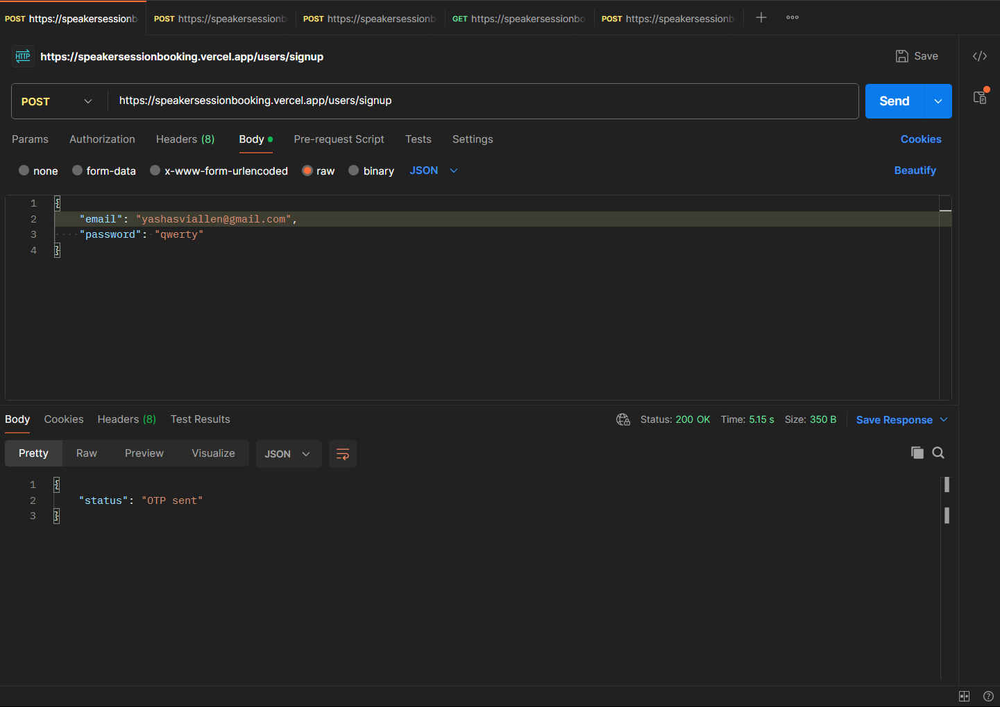
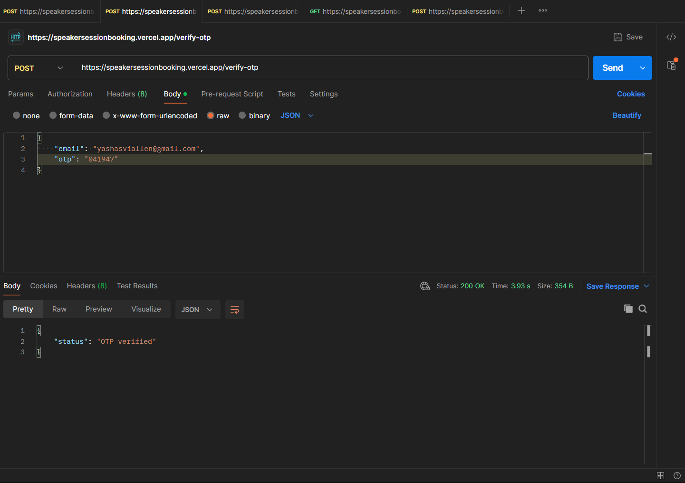
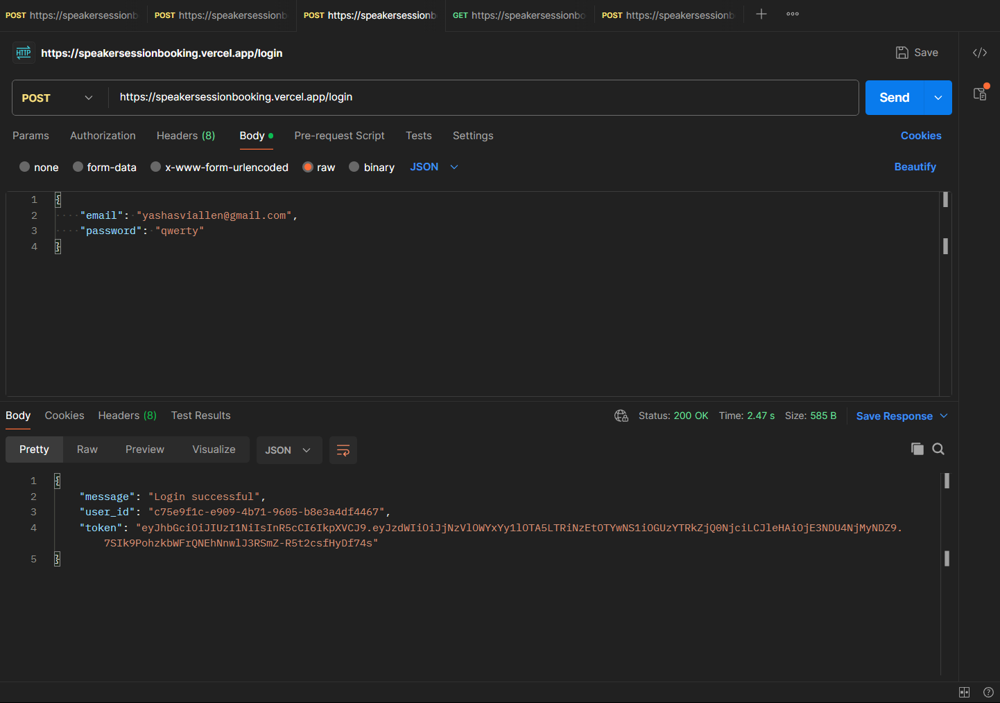
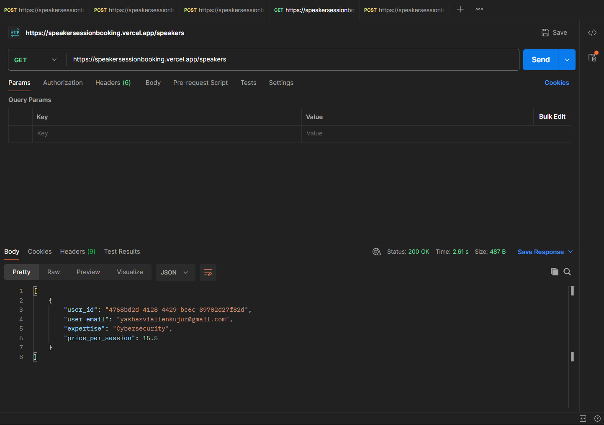
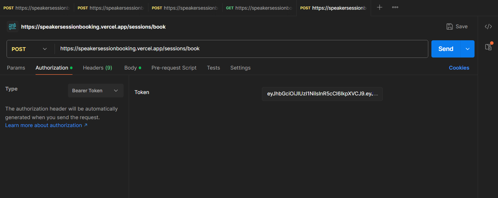
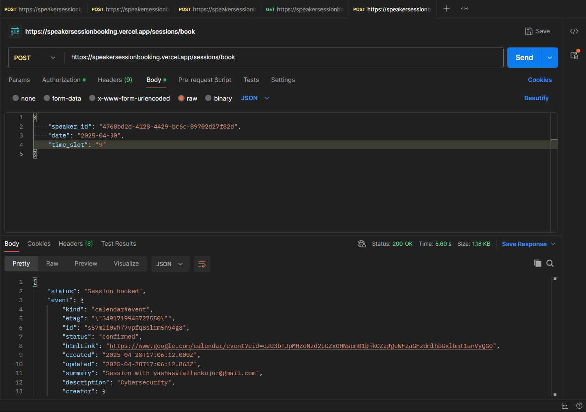

# 🎤 Speaker Session Booking Platform

Welcome to the Speaker Session Booking backend system!  
This project enables users to browse available speakers, view expertise, and book sessions conveniently with OTP-based authentication, protected routes, email notifications, and Google Calendar event creation.

---

## 🚀 Live Deployment

Hosted at: [https://speakersessionbooking.vercel.app/](https://speakersessionbooking.vercel.app/)

API Documentation (Swagger):  
- Visit [docs](https://speakersessionbooking.vercel.app/docs) to view API documentation.

---

## 🛠️ Tech Stack

- **Backend Framework:** FastAPI (Python)
- **Database:** PostgreSQL (via Supabase)
- **Authentication:** JWT Token based
- **Rate Limiting:** SlowAPI
- **Email Service:** SMTP (Gmail)
- **Google Calendar Integration:** Google OAuth2 API
- **Hosting:** Vercel

---

## 📚 Features

### 1. User and Speaker Profiles
- Signup with email and password
- Email OTP verification before login
- JWT token generation upon successful login
- Role-based access control (`user`, `speaker`)

### 2. Speaker Listings
- Speakers can create profiles with their expertise and price per session
- Protected route: only authenticated speakers can create listings

### 3. Session Booking
- Authenticated users can browse available speakers
- Users can book a 1-hour time slot between **9 AM to 4 PM UTC**
- Double bookings are prevented automatically

### 4. Time Slot Blocking
- Once a user books a session, the selected time slot is blocked from others

### 5. Email Notifications and Calendar Events
- Email notifications are sent to both the speaker and user upon booking
- A Google Calendar event is automatically created and shared with both parties

### 6. Documentation
- Complete interactive API documentation available at `/docs` (Swagger UI)
- All request and response samples documented clearly

---

## 📸 Screenshots

| User Signup | OTP Verification | Successful Login |
|:-----------:|:-----------------:|:----------------:|
|  |  |  |

| Speaker Listing | Session Booking |
|:---------------:|:----------------:|:---------------------:|
|  |  |  |

*(Screenshots are placed inside the `/screenshots` folder.)*

---

## 🛡️ Authentication Flow

1. User/ Speaker signs up ➔ Receives OTP ➔ Verifies OTP
2. Successful login ➔ Gets JWT token
3. Token must be provided in the `Authorization: Bearer <token>` header for required endpoints